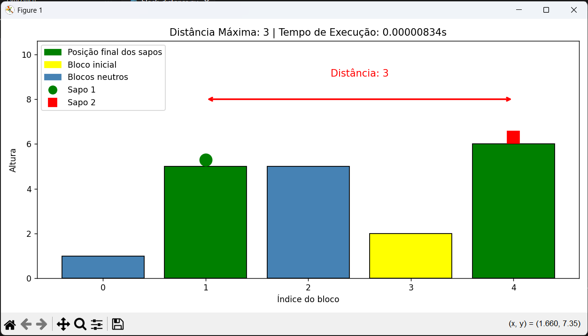

# 🐸 Frog Jump - Block Distance

A Python solution to the **Frog Jump** problem. Given a sequence of blocks with different heights, two frogs start from the same block and jump in opposite directions - each only able to move to adjacent blocks of equal or greater height. The goal is to find the starting block that maximises the total distance between the two frogs.

> Individual university project developed for the **Statistics Labs 2** course, focused on algorithm design, testing, and data visualization with Python.

## 🚀 Features

- Core algorithm to find the maximum reachable distance
- `matplotlib` visualization with color-coded blocks and frog positions
- Execution time measurement for each run
- Interactive menu with three input modes:
  - Manual input (number by number)
  - Random list generation
  - Predefined test cases
- Automated test suite with expected results validation

## 📸 Preview



## 🧠 How It Works

Each frog starts at the same block and jumps in opposite directions:

- **Left frog** moves left as long as the next block is equal or higher
- **Right frog** moves right as long as the next block is equal or higher
- The algorithm tests every possible starting block and returns the one that produces the maximum distance

The result is displayed as a bar chart where:

- 🟡 **Yellow** — starting block
- 🟢 **Green** — final positions of both frogs
- 🔵 **Blue** — neutral blocks
- 🔴 **Arrow** — total distance between frogs

## 📦 Installation

Clone the repository:

```bash
git clone https://github.com/EdgarReaper/block-distance.git
cd block-distance
pip install -r requirements.txt
python block_distance.py
```

## 🧪 Running Tests

```bash
python test_block_distance.py
```

The test suite runs 7 cases with known expected results and reports how many passed or failed.
